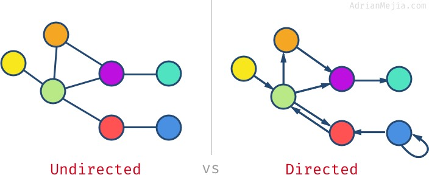

# Data Structures
[8 common data structures in javascript](https://betterprogramming.pub/8-common-data-structures-in-javascript-3d3537e69a27)
##\** Stack
Stack follows the principle of LIFO (Last In First Out). If you stack books, the top book will be taken before the bottom one. Or when you browse on internet, the back button leads you to the most recently browsed page.
Stack has these common methods:
- `push`: input a new element
- `pop` : remove the top element, return the removed element
- `peek` : return the top element
- `length` : return the number of element(s) in Stack
```typescript
function Stack() {
    this.count = 0;
    this.storage = {};

    this.push = function (value) {
      this.storage[this.count] = value;
      this.count++;
    }
  
    this.pop = function () {
      if (this.count === 0) {
        return undefined;
      }
      this.count--;
      var result = this.storage[this.count];
      delete this.storage[this.count];
      return result;
    }
  
    this.peek = function () {
      return this.storage[this.count - 1];
    }
  
    this.size = function () {
      return this.count;
    }
}
```
##\** Queue
Queue is similar to Stack.
The only difference is that Queue uses the FIFO principle (First In First Out).
In other words, when you queue for bus, the first in the queue will always board first.
Queue has the following methods:
- enqueue: enter queue, add an element at the end
- dequeue: leave queue, remove the front element and return it
- front: get the first element
- isEmpty: determine whether the queue is empty
- size: get the number of element(s) in queue
```typescript
function Queue() {
  let collection = [];
  
  this.print = function () {
    console.log(collection);
  }
  
  this.enqueue = function (element) {
    collection.push(element);
  }
  
  this.dequeue = function () {
    return collection.shift();
  }
  
  this.front = function () {
    return collection[0];
  }
  
  this.isEmpty = function () {
    return collection.length === 0;
  }
  
  this.size = function () {
    return collection.length;
  }
}
```
Queue has another advanced version.
Allocate each element with priority, and it will be sorted according to the priority level

##\** List
Literally, a linked list is a chained data structure, with each node consisting of two pieces of information:
the data of the node and the pointer to the next node.
Linked list and conventional array are both linear data structures with serialised storage.
Of course, they also have differences:

| Comparison               | Array                                                             | Linked List                                                                     |
|--------------------------|-------------------------------------------------------------------|---------------------------------------------------------------------------------|
| Memory Allocation        | Static memory allocation, happens during compiling and sequential | Dynamic memory allocation, happens during running and non-sequential            |
| Get elements             | Read from index, faster in speed                                  | Read through all nodes in queue until get the specific element, slower in speed |
| Add/Delete elements      | Due to sequential and static memory, slower in speed              | Due to dynamic allocation, only require minor memory overhead, faster in speed  |
| Spatial(space) structure | 1 dimension or multi-dimension                                    | Unilateral/bilateral (one way or two ways), or circular linked list             |

Circular Linked List is a variation of Linked list
in which the first element points to the last element and the last element points to the first element.

A unilateral linked list normally has the following methods:
- `size`: Return the number of node(s)
- `head`: Return the element of the head
- `add`: Add another node in the tail
- `remove`: Remove certain node
- `indexOf`: Return the index of a node
- `elementAt`: Return the node of an index
- `addAt`: Insert a node at a specific index
- `removeAt`: Delete a node at a specific index

##\*** Hash table


A hash table is a key-value data structure.
Due to the lightning speed of querying a value through key,
it is commonly used in Map, Dictionary or Object data structures.
As shown in the graph above, the hash table uses a `hash function` to convert keys into a list of numbers,
and these numbers serve as the values of corresponding keys.
To get value using key is dashingly fast, time complexity can achieve O(1).
The same keys must return the same values — this is the basis of the hash function.

The hash table has the following methods:
- `add`: Add a key-value pair
- `remove`: Delete a key-value pair
- `lookup`: Find a corresponding value using a key

##\*** Tree


Tree data structure is a multi-layer structure.
It is also a non-linear data structure,
compared to Array, Stack, and Queue. This structure is highly efficient during insert and search operations.
Let’s take a look at some concepts of tree data structure:
- `root`: Root node of a tree, no parent node for root
- `parent node`: Direct node of the upper layer, only has one
- `child node`: Direct node(s) of the lower layer, can have multiple
- `siblings`: Share the same parent node
- `leaf`: Node with no child
- `Edge`: Branch or link between nodes
- `Path`: The edges from a starting node to the target node
- `Height of Node`: Number of edges of the longest path of a specific node to leaf node
- `Height of Tree`: Number of edges of the longest path of the root node to the leaf node
- `Depth of Node`: Number of edges from root node to specific node
- `Degree of Node`: Number of child nodes

##\*** Trie (pronounced try)


Trie, or “Prefix Tree”, is also a type of search tree.
Trie stores the data step-by-step — each node in the tree represents a step.
Trie is used in storing vocabulary, it can be quickly searched, especially for an auto-complete function.

Each node in Trie has an alphabet — following the branch can form a complete word.
It also comprises a boolean indicator to show whether is this the last alphabet.

Trie has the following methods:
- `add`: Insert a word into the dictionary tree
- `isWord`: Determine whether the tree consists of certain word
- `print`: Return all words in the tree

##\*** [Graph](https://adrianmejia.com/data-structures-for-beginners-graphs-time-complexity-tutorial/)


Graph, sometimes known as network, refers to sets of nodes with linkages (or edges).
It could be further divided into two groups (ie. directed graphs and undirected graphs),
according to whether the linkages have direction.
Graph is widely used in our lives — to calculate the best route in navigation apps,
or to show recommended friends in social media, to take two examples.

A graph is a data structure where a node can have zero or more adjacent (neighbor) elements.

The connection between two nodes is called edge. Nodes can also be called vertices.

The degree is the number of edges connected to a vertex.
E.g., the `purple` vertex has a degree of `3` while the `blue` one has a degree of `1`.

If the edges are `bi-directional`, then we have an `undirected` graph.
If the edges have a `direction`, then we have a `directed` graph or di-graph for short.
You can think of it as a one-way street (directed) or two-way street (undirected).



Vertex can have edges that go to itself (e.g., `blue` node). This is called `self-loop`.

A graph can have cycles, which means you could get the same node more than once.
The graph without cycles is called acyclic graph.


Also, acyclic undirected graphs are called `tree`.

Not all vertices have to be connected in the graph.
You might have isolated nodes or even separated subgraphs.
If all nodes have at least one edge, then we have a `connected graph`.
When all nodes are connected to all other nodes, then we have a `complete graph`.


For a complete graph, each node should have `#nodes - 1` edges.
