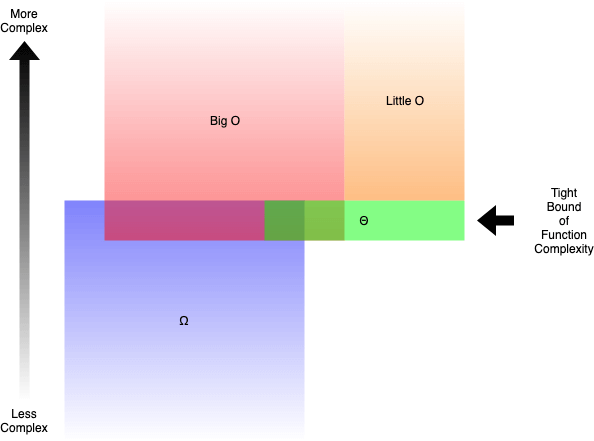

# Fundamental ProgrammingConcepts

## \* Difference between == and ===

Strict equality using ===

Strict equality compares two values for equality.
Neither value is implicitly converted to some other value before being compared.
If the values have different types, the values are considered unequal.
If the values have the same type, are not numbers, and have the same value, they're considered
equal. Finally, if both values are numbers, they're considered equal if they're both not NaN
and are the same value, or if one is `+0` and one is `-0`.

Loose equality using ==

Loose equality compares two values for equality after converting both values to a common type.
After conversions (one or both sides may undergo conversions),
the final equality comparison is performed exactly as === performs it.
`undefined` and `null` are loosely equal; that is, `undefined == null` is `true`

## \*\* What's the difference between an Object (JavaScript Object) and a Map?

1. A Map is ordered and iterable,
   whereas a objects is not ordered and not iterable
2. We can put any type of data as a Map key,
   whereas objects can only have a number, string, or symbol as a key.
3. A Map inherits from Map.prototype.
   This offers all sorts of utility functions and properties
   which makes working with Map objects a lot easier.

## \*\* Describe steps of Breadth-First Search for graphs

Breadth-first search is a way to navigate a graph from
an initial vertex by visiting all the adjacent nodes first.

## \*\* Describe steps of Depth-First Search for graphs

Depth-first search is another way to navigate a graph from an initial vertex
by recursively the first adjacent node of each vertex found.

## \*\*\* [Big-O complexities](https://www.freecodecamp.org/news/big-o-notation-why-it-matters-and-why-it-doesnt-1674cfa8a23c/)

Big O notation is one of the most fundamental tools for computer scientists to analyze the
cost of an algorithm.

> Big O notation is a mathematical notation that describes the limiting behavior
> of a function when the argument tends towards a particular value or infinity.
> In plain words, Big O notation describes the complexity of your code using algebraic terms.

#### Big O, Little O, Omega & Theta

- Big O (O()) describes the upper bound of the complexity.
- Omega (Ω()) describes the lower bound of the complexity.
- Theta (Θ()) describes the exact bound of the complexity.
- Little O (o()) describes the upper bound excluding the exact bound.

Generally, when we talk about Big O, what we actually meant is Theta.
It is kind of meaningless when you give an upper bound that is way larger than the scope
of the analysis. This would be similar to solving inequalities by putting ∞ on the larger side,
which will almost always make you right.

When we are trying to figure out the Big O for a particular function `g(n)`,
we only care about the dominant term of the function. The dominant term is the term that
grows the fastest.

For example, `n²` grows faster than `n`,
so if we have something like `g(n) = n² + 5n + 6`, it will be big `O(n²)`.
If you have taken some calculus before,
this is very similar to the shortcut of finding limits for fractional polynomials,
where you only care about the dominant term for numerators and denominators in the end.

#### Complexities

1. `O(1)` has the least complexity
   Often called “constant time”, if you can create an algorithm to solve the problem in `O(1)`,
   you are probably at your best. In some scenarios, the complexity may go beyond `O(1)`,
   then we can analyze them by finding its `O(1/g(n))` counterpart.
   For example, `O(1/n)` is more complex than `O(1/n²)`.
2. `O(log(n))` is more complex than `O(1)`, but less complex than polynomials
   As complexity is often related to divide and conquer algorithms,
   `O(log(n))` is generally a good complexity you can reach for sorting algorithms.
   `O(log(n))` is less complex than `O(√n)`,
   because the square root function can be considered a polynomial, where the exponent is `0.5`.
3. Complexity of polynomials increases as the exponent increases.
   For example, `O(n⁵)` is more complex than `O(n⁴)`.
4. Exponentials have greater complexity than polynomials as long as the coefficients are
   positive multiples of n. `O(2ⁿ)` is more complex than `O(n⁹⁹)`, but `O(2ⁿ)` is actually less
   complex than `O(1)`. We generally take 2 as base for exponentials and logarithms because
   things tends to be binary in Computer Science, but exponents can be changed by changing the
   coefficients. If not specified, the base for logarithms is assumed to be 2.
5. Factorials have greater complexity than exponentials.
6. Multiplying terms. When multiplying, the complexity will be greater than the original,
   but no more than the equivalence of multiplying something that is more complex.
   For example, `O(n * log(n))` is more complex than `O(n)` but less complex than `O(n²)`,
   because `O(n²) = O(n * n)` and n is more complex than `log(n)`.

#### Time & Space Complexity

So far, we have only been discussing the time complexity of the algorithms.
That is, we only care about how much time it takes for the program to complete the task.
What also matters is the space the program takes to complete the task.
The space complexity is related to how much memory the program will use,
and therefore is also an important factor to analyze.

The space complexity works similarly to time complexity.
For example, selection sort has a space complexity of `O(1)`,
because it only stores one minimum value and its index for comparison,
the maximum space used does not increase with the input size.

Some algorithms, such as bucket sort, have a space complexity of `O(n)`,
but are able to chop down the time complexity to `O(1)`.
Bucket sort sorts the array by creating a sorted list of all the possible elements in the array,
then increments the count whenever the element is encountered.
In the end the sorted array will be the sorted list elements repeated by their counts.

#### Why BigO does not matter

Big O notation is only a mathematical analysis to provide a reference on the resources
consumed by the algorithm. Practically, the results may be different.
But it is generally a good practice trying to chop down the complexity of our algorithms,
until we run into a case where we know what we are doing.

#### Question: An image is represented by a 2D array of pixels.

If you use a nested for loop to iterate through every pixel
(that is, you have a for loop going through all the columns, then another for loop inside
to go through all the rows),
what is the time complexity of the algorithm when the image is considered as the input?

#### Answer:

The question tries to make you answer `O(n²)` because there is a nested for loop.
However, `n` is supposed to be the input size. Since the image array is the input,
and every pixel was iterated through only once, the answer is actually `O(n)`.
