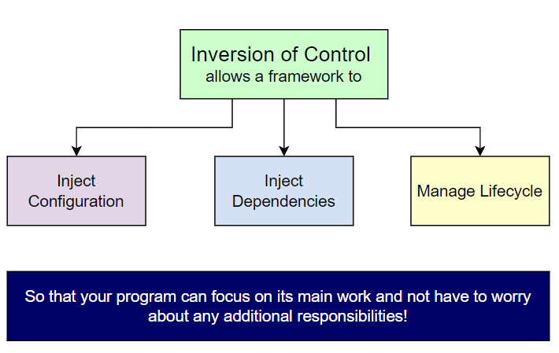

# Object-Oriented Programing
##\* [OOP basics](https://www.imaginarycloud.com/blog/functional-programming-vs-oop/#key)
Object-oriented programming is an imperative programming paradigm,
that organizes data and the software structure based on the concept of classes and objects.

###\* Class
Classes are a set of instructions (or blueprints)
that establish a data structure for a specific object,
determining what the object will contain
(the types of variables that can exist in an object)
and how it will behave (the methods or member functions
that define how to operate on the variables).
Thus, objects are instances of classes since classes work
as "templates" to create objects.
Plus, objects can contain data in the form of fields
(also known as attributes)
and code in the form of procedures (also named methods).
###\* Instance
Instance is a concrete occurrence of any object, existing usually during the runtime of a computer program.
Formally, "instance" is synonymous with "object" as they are each a particular value (realization),
and these may be called an instance object; "instance" emphasizes the distinct identity of the object.
The creation of an instance is called instantiation.
###\* Method
###\* Abstract Class
Abstract class is only available in typescript.
- Abstract classes can be defined as classes that cannot be instantiated
i.e. whose object reference cannot be created and contains within it,
one or more abstract methods.
- An abstract method is a method that can only be declared
but has no implementation to it.
- Abstract classes need to be inherited and require subclasses
to provide implementations for the method declared in the abstract class.
As in Java, we have the abstract keyword to make a class an abstract class,
there are no such reserve keywords in JavaScript to declare a class an abstract class.
###\* Interface
An interface is a programming structure/syntax
that allows the computer to enforce certain properties on an object (class).
###\* Abstract Class vs Interface
An abstract class allows you to create functionality
that subclasses can implement or override.
An interface only allows you to define functionality, not implement it.
###\* Encapsulation
Encapsulation is an ability to encapsulate variables within a class from outside access.
Properties and methods can be private or public.
OOP languages allow developers to establish multiple degrees of visibility.
###\** Polymorphism
Polymorphism is the provision of a single interface to entities of different types.
The concept is borrowed from a principle in biology where an organism or species can have many different forms or stages.
Entries can have more than one form.
###\** Inheritance
It allows classes to inherit states and behaviors from their superclasses,
which also means that this principle supports re-usability.
It is a mechanism where you can to derive a class from another class
for a hierarchy of classes that share a set of attributes and methods.

[Pitfalls of Inheritance Modeling](https://www.codemag.com/article/0002081/Some-Pitfalls-of-Inheritance):
- **Inheritance is purely static in nature**. Inter-object dynamics -
the actual relationships between object instances -
aren't easily specified in class diagrams.
In other words, an inheritance hierarchy gives few clues
about how objects actually work together.
- **Inheritance casts behavior at design-time**,
and that's inherently less flexible than composition,
which can be applied at design-time as well as at run-time.
The best object-oriented systems use a combination of
inheritance and composition. Typically, inheritance is
used to define interfaces and the most general core behaviors,
whereas composition is used to separate interfaces and core
behaviors from concrete implementations.
- **Inheritance hierarchies should be as flat as possible**,
because deep class hierarchies are more difficult
to work with and to maintain than flat ones.
- **Factor common behavior and data as high as possible in the hierarchy**,
so that as more derived classes can take advantage of a common abstraction
- **Separate interfaces from implementations**,
so that each may vary separately. Separating form (interface)
from function (implementation) means that these independent elements
can be more freely and flexibly altered, and potentially reused separately.
- **yo-yo problem** is an anti-pattern that occurs when a programmer
has to read and understand a program whose inheritance graph is so long
and complicated that the programmer has to keep flipping between
many different class definitions in order to follow the control flow of the program.
###\** Abstraction
Hides complex details to reduce complexity.
###\* SOLID
SOLID is an acronym for the first five object-oriented design (OOD)
principles by Robert C. Martin.
These principles establish practices that lend to developing software
with considerations for maintaining and extending as the project grows.
- **Single-Responsibility** - a class should have one and only one reason to change,
meaning that a class should have only one job.
- **Open-Closed** - objects or entities should be open for extension
but closed for modification. This means that a class should be extendable without modifying the class itself.
- **Liskov Substitution** - if class A is a subtype of class B,
we should be able to replace B with A without disrupting the behavior of our program.
- **Interface Segregation** - a client should never be forced to implement
an interface that it doesn’t use, or clients shouldn’t be forced to depend
on methods they do not use. Larger interfaces should be split into smaller ones.
- **Dependency Inversion** - refers to the decoupling of software modules.
This way, instead of high-level modules depending on low-level modules,
both will depend on abstractions. Entities must depend on abstractions, not on concretions.
###\*** [Coupling and Cohesion](https://home.adelphi.edu/sbloch/class/adages/coupling_cohesion.html)
**Coupling** describes the relationships between modules,
and **cohesion** describes the relationships within them.
A reduction in interconnectedness between modules (or classes)
is therefore achieved via a reduction in coupling.
On the other hand, well-designed modules (or classes) should have some purpose;
all the elements should be associated with a single task.
This means that in a good design, the elements within a module (or class)
should have internal cohesion.
###\*** [Inversion of control principle](https://www.educative.io/edpresso/what-is-inversion-of-control)
One of the major principles of Software Engineering is that classes should have
minimum interdependence, i.e., low coupling. Inversion of Control (IoC)
is a design principle that allows classes to be loosely coupled and,
therefore, easier to test and maintain. IoC refers to transferring the control
of objects and their dependencies from the main program to a container
or framework. IoC is a principle, not a design pattern – the implementation
details depend on the developer. All IoC does is provide high-level guidelines.

Inversion of Control and Dependency Injection are often used interchangeably.
However, Dependency Injection is only one implementation of IoC.
- **Dependency injection** is a technique that allows objects to be separated
from the objects they depend upon.
- **Service Locator Pattern** includes service locator object that contains
information about all the services that an application provides.
- **Event-driven programs**, as opposed to sequential programs

Benefits of IoC:
- Reduces amount of application code
- Decreases coupling between classes
- Makes the application easier to test and maintain

###\*** [Association, Aggregation and Composition](https://www.visual-paradigm.com/guide/uml-unified-modeling-language/uml-aggregation-vs-composition/)
**Association** is a relation between two separate classes which establishes through
their Objects. Association can be one-to-one, one-to-many, many-to-one, many-to-many.
In Object-Oriented programming, an Object communicates to another object to use
functionality and services provided by that object.

If two classes in a model need to communicate with each other, there must be a link
between them, and that can be represented by an association (connector).
A single student can associate with multiple teachers:

**Aggregation** and **Composition** are subsets of association meaning they are
**specific cases of Association**. In both aggregation and composition object of one class
"owns" object of another class. But there is a subtle difference:
- **Aggregation** implies a relationship where the child can exist independently
of the parent. Example: Class (parent) and Student (child).
Delete the Class and the Students still exist.
- **Composition** implies a relationship where the child cannot exist independent of the
parent. Example: House (parent) and Room (child). Rooms don't exist separate to a House.

####Aggregation Example:
It's important to note that the aggregation link does not state in any way that
Class A owns Class B nor that there's a parent-child relationship
(when parent deleted all its child's are being deleted as a result) between the two.
Actually, quite the opposite! The aggregation link is usually used to stress
the point that Class A instance is not the exclusive container of Class B instance,
as in fact the same Class B instance has another container/s.

####Composition Example:
We should be more specific and use the composition link in cases where in addition
to the part-of relationship between Class A and Class B - there's a strong lifecycle
dependency between the two, meaning that when Class A is deleted then Class B is
also deleted as a result.

###\***
###\***
###\***
###\***
###\***
###\***
