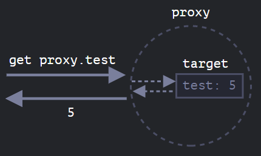

### \*** [Proxy](https://javascript.info/proxy)
A Proxy object wraps another object and intercepts operations, like reading/writing properties
and others, optionally handling them on its own, or transparently allowing the object to handle them.
It can wrap any kind of object, including classes and functions.
```typescript
let proxy = new Proxy(target, handler)
```
- `target` – is an object to wrap, can be anything, including functions.
- `handler` – proxy configuration: an object with “traps”, methods that intercept
  operations. – e.g. `get` trap for reading a property of target, `set` trap for writing a property into target, and so on.

Without any traps, proxy is a transparent wrapper around target:

Proxy is a special “exotic object”. It doesn’t have own properties.
With an empty handler it transparently forwards operations to target.

For most operations on objects, there’s a so-called “internal method” in the JavaScript specification
that describes how it works at the lowest level. For instance `[[Get]]`, the internal method
to read a property, `[[Set]]`, the internal method to write a property, and so on.
These methods are only used in the specification, we can’t call them directly by name.

Proxy traps intercept invocations of these methods.

| Internal Method         | Handler Method             | Triggers when…                                                                                        |
|-------------------------|----------------------------|-------------------------------------------------------------------------------------------------------|
| `[[Get]]`               | `get`                      | reading a property                                                                                    |
| `[[Set]]`               | `set`                      | writing to a property                                                                                 |
| `[[HasProperty]]`       | `has`                      | `in` operator                                                                                         |
| `[[Delete]]`            | `deleteProperty`           | `delete` operator                                                                                     |
| `[[Call]]`              | `apply`                    | function call                                                                                         |
| `[[Construct]]`         | `construct`                | `new` operator                                                                                        |
| `[[GetPrototypeOf]]`    | `getPrototypeOf`           | `Object.getPrototypeOf`                                                                               |
| `[[SetPrototypeOf]]`    | `setPrototypeOf`           | `Object.setPrototypeOf`                                                                               |
| `[[IsExtensible]]`      | `isExtensible`             | `Object.isExtensible`                                                                                 |
| `[[PreventExtensions]]` | `preventExtensions`        | `Object.preventExtensions`                                                                            |
| `[[DefineOwnProperty]]` | `defineProperty`           | `Object.defineProperty`, `Object.defineProperties`                                                    |
| `[[GetOwnProperty]]`    | `getOwnPropertyDescriptor` | `Object.getOwnPropertyDescriptor`, `for..in`, `Object.keys/values/entries`                            |
| `[[OwnPropertyKeys]]`   | `ownKeys`                  | `Object.getOwnPropertyNames`, `Object.getOwnPropertySymbols`, `for..in`, `Object.keys/values/entries` |


