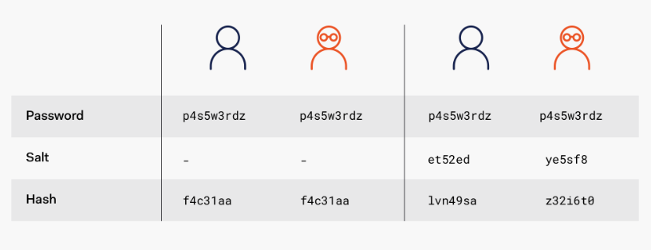

## [Adding salt to hashing](https://auth0.com/blog/adding-salt-to-hashing-a-better-way-to-store-passwords/)

### Recap

- A cryptographic salt is made up of random bits added to each password instance before its hashing.
- Salts create unique passwords even in the instance of two users choosing the same passwords.
- Salts help us mitigate hash table attacks by forcing attackers to re-compute them using the salts for each user.
- Creating cryptographically strong random data to use as salts is very complex, and it's a job better
  left to leading security solutions and providers.

### Intro

Hashed passwords are not unique to themselves due to the deterministic nature of hash function:
when given the same input, the same output is always produced. If Alice and Bob both choose
`dontpwnme4` as a password, their hash would be the same.

### Mitigating Password Attacks with Salt

According to OWASP Guidelines, a salt is a value generated by a cryptographically secure function, that is added to 
the input of hash functions. A salt makes a hash function look non-deterministic, which is good as we don't want to 
reveal duplicate passwords through our hashing.

Let’s say that we have password `farm1990M0O` and the salt `f1nd1ngn3m0`. We can salt that password by either 
appending or prepending the salt to it. For example: `farm1990M0Of1nd1ngn3m0` or `f1nd1ngn3m0farm1990M0O` are valid 
salted passwords. Once the salt is added, we can then hash it.

