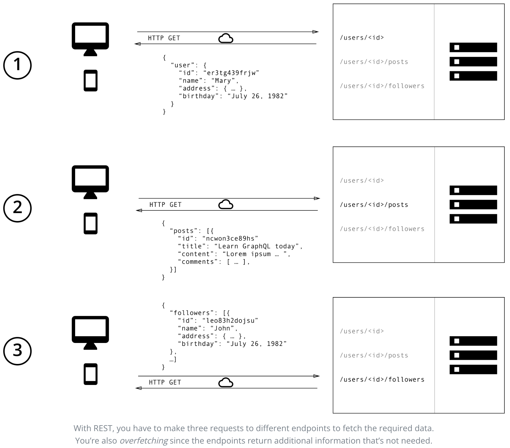
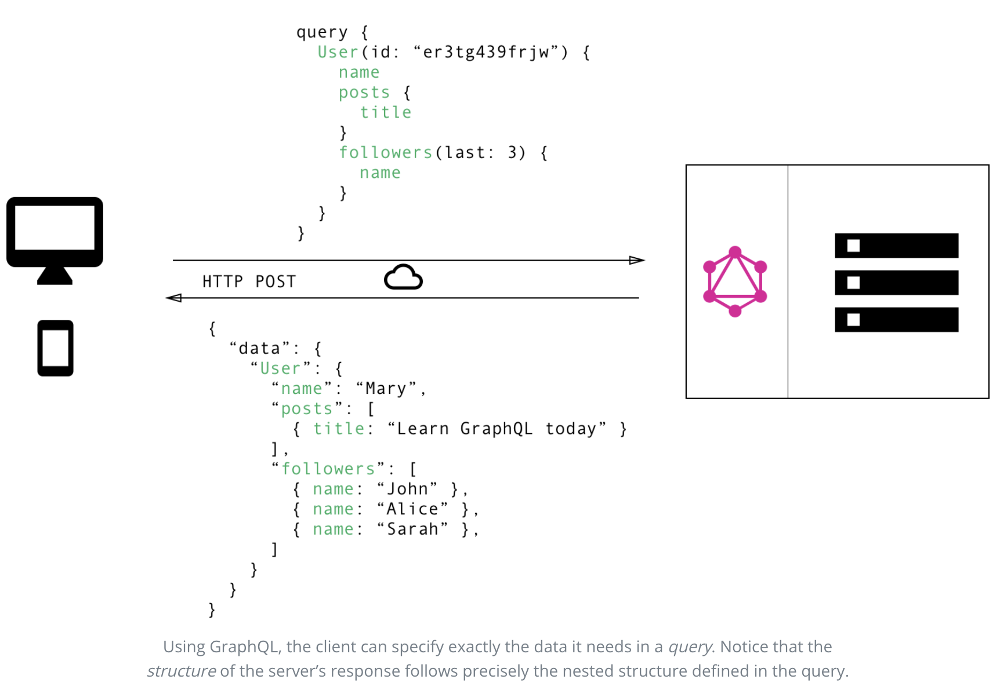

## [GraphQL](https://www.howtographql.com/basics/0-introduction/)

### Introduction

GraphQL is a new API standard developed by Facebook. It enables declarative data-fetching.

GraphQL server exposes single endpoint and responses to queries.

GraphQL is a query language for your API, and a server-side runtime for executing queries using
a type system you define for your data. GraphQL isn't tied to any specific database or storage
engine and is instead backed by your existing code and data.

### A more efficient alternative to REST:

REST has been a popular way to expose data from a server. When the concept of REST was 
developed, client applications were relatively simple and the development pace wasn’t nearly 
where it is today. REST thus was a good fit for many applications. However, the API landscape 
has radically changed over the last couple of years. In particular, there are three factors 
that have been challenging the way APIs are designed:

1. Increased mobile usage creates need for efficient data loading
2. Variety of different frontend frameworks and platforms
3. Fast development & expectation for rapid feature development

### GraphQL is the better REST

With a REST API, you would typically gather the data by accessing multiple endpoints. In the 
example, these could be `/users/<id>` endpoint to fetch the initial user data. Secondly, there’s 
likely to be a `/users/<id>/posts` endpoint that returns all the posts for a user. The third 
endpoint will then be the `/users/<id>/followers` that returns a list of followers per user.

In GraphQL on the other hand, you’d simply send a single query to the GraphQL server that 
includes the concrete data requirements. The server then responds with a JSON object where 
these requirements are fulfilled.

### No more Over- and Underfetching

One of the most common problems with REST is that of over- and underfetching. This happens 
because the only way for a client to download data is by hitting endpoints that return fixed 
data structures. It’s very difficult to design the API in a way that it’s able to provide 
clients with their exact data needs.

###### Overfetching: Downloading superfluous data

Overfetching means that a client downloads more information than is actually required in the 
app. Imagine for example a screen that needs to display a list of users only with their names. 
In a REST API, this app would usually hit the `/users` endpoint and receive a JSON array with 
user data. This response however might contain more info about the users that are returned, e.g.
their birthdays or addresses - information that is useless for the client because it only needs 
to display the users’ names.

###### Underfetching and the n+1 problem

Another issue is underfetching and the n+1-requests problem. Underfetching generally means that 
a specific endpoint doesn’t provide enough of the required information. The client will have to 
make additional requests to fetch everything it needs. This can escalate to a situation where a 
client needs to first download a list of elements, but then needs to make one additional 
request per element to fetch the required data.

### Rapid Product Iterations on the Frontend

With every change that is made to the UI, there is a high risk that now there is more (or less) 
data required than before. Consequently, the backend needs to be adjusted as well to account 
for the new data needs. This kills productivity and notably slows down the ability to 
incorporate user feedback into a product.

With GraphQL, this problem is solved. Thanks to the flexible nature of GraphQL, changes on the 
client-side can be made without any extra work on the server.

### Benefits of a Schema & Type System

GraphQL uses a strong type system to define the capabilities of an API. All the types that are 
exposed in an API are written down in a schema using the GraphQL Schema Definition Language 
(SDL). This schema serves as the contract between the client and the server to define how a 
client can access the data.

Once the schema is defined, the teams working on frontend and backends can do their work 
without further communication since they both are aware of the definite structure of the data 
that’s sent over the network.
