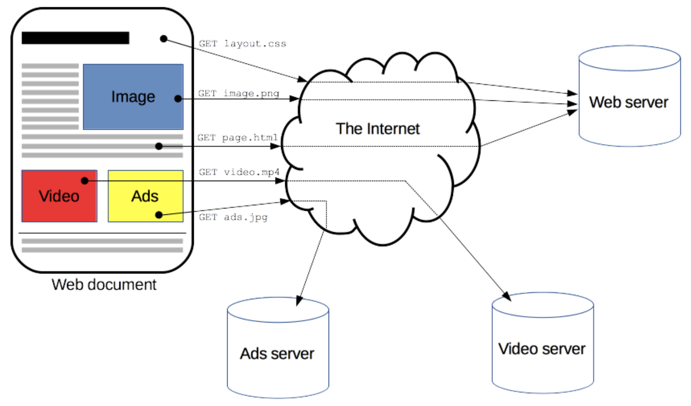
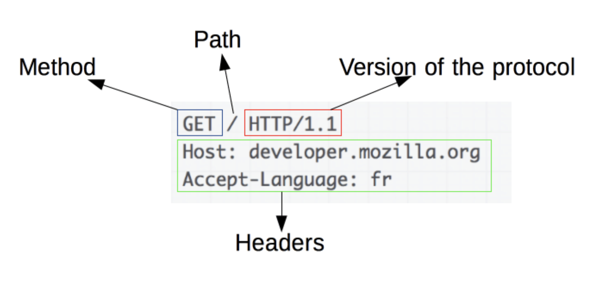
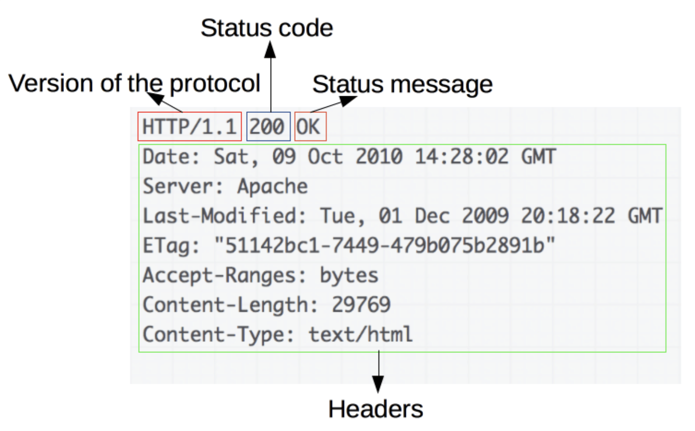

## [HTTP Overview](https://developer.mozilla.org/en-US/docs/Web/HTTP/Overview)

Designed in the early 1990s, HTTP is an extensible protocol which has evolved over time. It is
an application layer protocol that is sent over TCP, or over a TLS-encrypted TCP connection,
though any reliable transport protocol could theoretically be used. Due to its extensibility,
it is used to not only fetch hypertext documents, but also images and videos or to post content
to servers, like with HTML form results.

In reality, there are more computers between a browser and the server handling the request:
there are routers, modems, and more. Thanks to the layered design of the Web, these are hidden
in the network and transport layers. HTTP is on top, at the application layer.

HTTP is an extensible protocol that relies on concepts like resources and Uniform Resource
Identifiers (URIs), simple message structure, and client-server communication flow.

HTTP is a protocol for fetching resources such as HTML documents. It is the foundation of any
data exchange on the Web and it is a client-server protocol, which means requests are initiated
by the recipient, usually the Web browser. A complete document is reconstructed from the
different sub-documents fetched, for instance, text, layout description, images, videos,
scripts, and more.



### Client: the user-agent

The user-agent is any tool that acts on behalf of the user. This role is primarily performed by
the Web browser

To display a Web page, the browser sends an original request to fetch the HTML document that
represents the page. It then parses this file, making additional requests corresponding to
execution scripts, layout information (CSS) to display, and sub-resources contained within the
page (usually images and videos). The Web browser then combines these resources to present the
complete document, the Web page. Scripts executed by the browser can fetch more resources in
later phases and the browser updates the Web page accordingly.

### The Web server

On the opposite side of the communication channel is the server, which serves the document as
requested by the client. A server appears as only a single machine virtually; but it may
actually be a collection of servers sharing the load (load balancing), or a complex piece of
software interrogating other computers (like cache, a DB server, or e-commerce servers),
totally or partially generating the document on demand.

A server is not necessarily a single machine, but several server software instances can be
hosted on the same machine. With HTTP/1.1 and the Host header, they may even share the same IP
address.

### Proxies

Between the Web browser and the server, numerous computers and machines relay the HTTP messages.
These can be transparent, forwarding on the requests they receive without altering them in any
way, or non-transparent, in which case they will change the request in some way before passing
it along to the server. Proxies may perform numerous functions:

- caching (the cache can be public or private, like the browser cache)
- filtering (like an antivirus scan or parental controls)
- load balancing (to allow multiple servers to serve different requests)
- authentication (to control access to different resources)
- logging (allowing the storage of historical information)

### Basic aspects of HTTP

###### HTTP is simple

HTTP is generally designed to be simple and human-readable, even with the added complexity
introduced in HTTP/2 by encapsulating HTTP messages into frames. HTTP messages can be read and
understood by humans, providing easier testing for developers, and reduced complexity for
newcomers.

###### HTTP is extensible

Introduced in HTTP/1.0, HTTP headers make this protocol easy to extend and experiment with. New
functionality can even be introduced by a simple agreement between a client and a server about
a new header's semantics.

###### HTTP is stateless, but not sessionless

HTTP is stateless: there is no link between two requests being successively carried out on the
same connection. This immediately has the prospect of being problematic for users attempting to
interact with certain pages coherently, for example, using e-commerce shopping baskets. But
while the core of HTTP itself is stateless, HTTP cookies allow the use of stateful sessions.
Using header extensibility, HTTP Cookies are added to the workflow, allowing session creation
on each HTTP request to share the same context, or the same state.

###### HTTP and connections

A connection is controlled at the transport layer, and therefore fundamentally out of scope for
HTTP. HTTP doesn't require the underlying transport protocol to be connection-based; it only
requires it to be reliable, or not lose messages (at minimum, presenting an error in such cases)
. Among the two most common transport protocols on the Internet, TCP is reliable and UDP isn't.
HTTP therefore relies on the TCP standard, which is connection-based.

### What can be controlled by HTTP

Here is a list of common features controllable with HTTP:

- Caching: How documents are cached can be controlled by HTTP. The server can instruct proxies
  and clients about what to cache and for how long. The client can instruct intermediate cache
  proxies to ignore the stored document.
- Relaxing the origin constraint: To prevent snooping and other privacy invasions, Web browsers
  enforce strict separation between Websites. Only pages from the same origin can access all
  the information of a Web page.
- Authentication: Some pages may be protected so that only specific users can access them.
  Basic authentication may be provided by HTTP, either using the WWW-Authenticate and similar
  headers, or by setting a specific session using HTTP cookies.
- Proxy and tunneling: Servers or clients are often located on intranets and hide their true IP
  address from other computers.
- Sessions: Using HTTP cookies allows you to link requests with the state of the server. This
  creates sessions, despite basic HTTP being a state-less protocol. This is useful not only for
  e-commerce shopping baskets, but also for any site allowing user configuration of the output.

### HTTP flow

When a client wants to communicate with a server, either the final server or an intermediate
proxy, it performs the following steps:

1. Open a TCP connection: The TCP connection is used to send a request, or several, and receive
   an answer. The client may open a new connection, reuse an existing connection, or open
   several TCP connections to the servers.
2. Send an HTTP message: HTTP messages (before HTTP/2) are human-readable. With HTTP/2, these
   simple messages are encapsulated in frames, making them impossible to read directly, but the
   principle remains the same. For example:
   ```http request
   GET / HTTP/1.1
   Host: developer.mozilla.org
   Accept-Language: fr
   ```
3. Read the response sent by the server, such as:

   ```http request
   HTTP/1.1 200 OK
   Date: Sat, 09 Oct 2010 14:28:02 GMT
   Server: Apache
   Last-Modified: Tue, 01 Dec 2009 20:18:22 GMT
   ETag: "51142bc1-7449-479b075b2891b"
   Accept-Ranges: bytes
   Content-Length: 29769
   Content-Type: text/html

   <!DOCTYPE html>… (here come the 29769 bytes of the requested web page)
   ```

4. Close or reuse the connection for further requests.

If HTTP pipelining is activated, several requests can be sent without waiting for the first
response to be fully received. HTTP pipelining has proven difficult to implement in existing
networks, where old pieces of software coexist with modern versions. HTTP pipelining has been
superseded in HTTP/2 with more robust multiplexing requests within a frame.

### HTTP Messages

HTTP messages, as defined in HTTP/1.1 and earlier, are human-readable. In HTTP/2, these
messages are embedded into a binary structure, a frame, allowing optimizations like compression
of headers and multiplexing. Even if only part of the original HTTP message is sent in this
version of HTTP, the semantics of each message is unchanged and the client reconstitutes
(virtually) the original HTTP/1.1 request. It is therefore useful to comprehend HTTP/2 messages
in the HTTP/1.1 format.

There are two types of HTTP messages, requests and responses, each with its own format.

###### Requests



Requests consist of the following elements:

- An HTTP method, usually a verb like GET, POST, or a noun like OPTIONS or HEAD that defines the
  operation the client wants to perform. Typically, a client wants to fetch a resource (using
  GET) or post the value of an HTML form (using POST), though more operations may be needed in
  other cases.
- The path of the resource to fetch; the URL of the resource stripped from elements that are
  obvious from the context, for example without the protocol (http://), the domain (here,
  developer.mozilla.org), or the TCP port (here, 80).
- The version of the HTTP protocol.
- Optional headers that convey additional information for the servers.
- A body, for some methods like POST, similar to those in responses, which contain the resource
  sent.

###### Responses



Responses consist of the following elements:

- The version of the HTTP protocol they follow.
- A status code, indicating if the request was successful or not, and why.
- A status message, a non-authoritative short description of the status code.
- HTTP headers, like those for requests.
- Optionally, a body containing the fetched resource.

### APIs based on HTTP

The most commonly used API based on HTTP is the XMLHttpRequest API, which can be used to
exchange data between a user agent and a server. The modern Fetch API provides the same
features with a more powerful and flexible feature set.

Another API, server-sent events, is a one-way service that allows a server to send events to
the client, using HTTP as a transport mechanism. Using the EventSource interface, the client
opens a connection and establishes event handlers. The client browser automatically converts
the messages that arrive on the HTTP stream into appropriate Event objects. Then it delivers
them to the event handlers that have been registered for the events' type if known, or to the
onmessage event handler if no type-specific event handler was established.

### Conclusion

HTTP is an extensible protocol that is easy to use. The client-server structure, combined with
the ability to add headers, allows HTTP to advance along with the extended capabilities of the Web.

Though HTTP/2 adds some complexity by embedding HTTP messages in frames to improve performance,
the basic structure of messages has stayed the same since HTTP/1.0. Session flow remains simple,
allowing it to be investigated and debugged with a simple HTTP message monitor.
